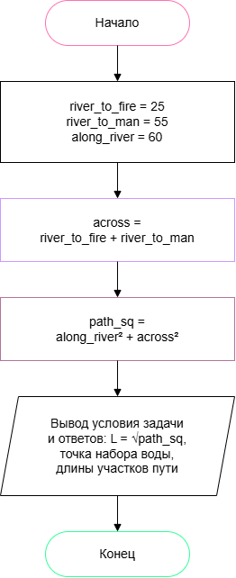

# Домашнее задание к работе 2

## Условие задачи
Вариант 16. Недалеко от реки на берегу горит костер. На том же берегу находится человек с ведром. Определить минимальное расстояние, которое должен пройти человек до костра, зачерпнув по дороге к нему воды в реке, если известны расстояния от реки до костра и до человека, и расстояние от костра до человека по течению реки. Река в этом месте течет по прямой.

## 1. Алгоритм и блок-схема

### Алгоритм

1. Начало
2. Задать исходные данные (в метрах):
   - river_to_fire = 25 — расстояние от реки до костра.
   - river_to_man = 55 — расстояние от реки до человека.
   - along_river = 60 — расстояние от костра до человека по течению реки.
3. Вычислить катет поперек реки. Костер мысленно отражается в реке: от любой точки берега до костра и до его отражения одинаковое расстояние, поэтому кратчайший путь — прямая от человека до отражения костра.
   - across = river_to_fire + river_to_man
4. Вычислить квадрат длины кратчайшего пути по теореме Пифагора:
   - path_sq = along_river * along_river + across * across
5. Вывести результаты расчетов с подстановкой всех значений в текст:
   - минимальное расстояние L = √`path_sq`;
   - место, где зачерпнуть воду (метров вдоль реки от точки напротив человека): along_river * river_to_man / across;
   - путь от человека до реки: L * river_to_man / across;
   - путь от реки до костра: L * river_to_fire / across.
6. **Конец**

### Блок-схема

(https://drive.google.com/file/d/1K36YHANuVxN658Kv5wAsP9JK5j-3CYDr/view?pli=1)

## 2. Реализация программы

<!-- Вставьте код программы-->

## 3. Результаты работы программы

[После запуска программы просто скопируйте вывод из консоли и вставьте его в этот раздел ]

## 4. Информация о разработчике

[Укажите фамилию, имя и группу ]
